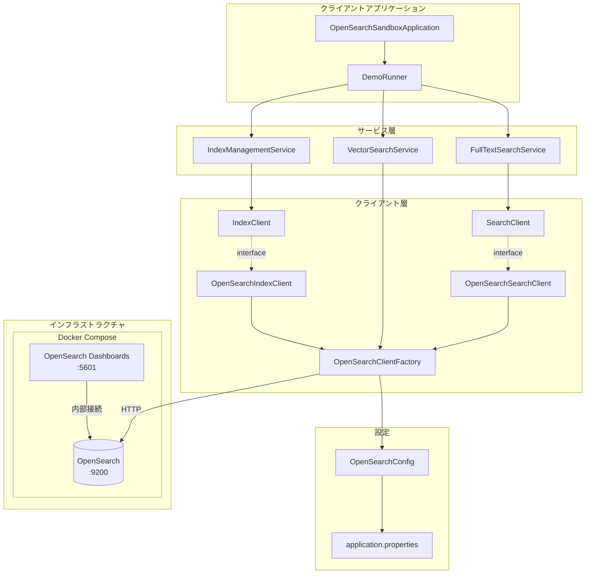
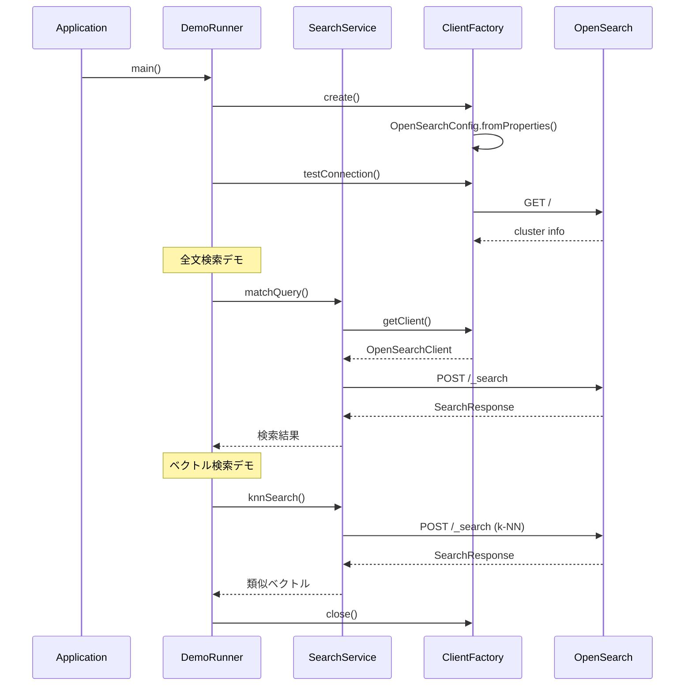

# アーキテクチャ図

## システム構成図



## レイヤー構成

```mermaid
flowchart LR
    subgraph Presentation["プレゼンテーション層"]
        direction TB
        A1[OpenSearchSandboxApplication]
        A2[DemoRunner]
    end

    subgraph Business["ビジネスロジック層"]
        direction TB
        B1[FullTextSearchService]
        B2[VectorSearchService]
        B3[IndexManagementService]
    end

    subgraph Data["データアクセス層"]
        direction TB
        C1[OpenSearchClientFactory]
        C2[SearchClient]
        C3[OpenSearchSearchClient]
        C4[IndexClient]
        C5[OpenSearchIndexClient]
    end

    subgraph External["外部システム"]
        direction TB
        D1[(OpenSearch)]
    end

    Presentation --> Business
    Business --> Data
    Data --> External
```



## パッケージ構成

```
com.kimai07.opensearch/
├── OpenSearchSandboxApplication.java   # エントリーポイント
│
├── config/                             # 設定
│   └── OpenSearchConfig.java           # 接続設定（Builder パターン）
│
├── client/                             # クライアント
│   ├── OpenSearchClientFactory.java    # クライアントファクトリ（シングルトン、Closeable）
│   ├── SearchClient.java               # 検索インターフェース
│   ├── OpenSearchSearchClient.java     # 検索実装
│   ├── IndexClient.java                # インデックスインターフェース
│   └── OpenSearchIndexClient.java      # インデックス実装
│
├── search/                             # 検索サービス
│   ├── FullTextSearchService.java      # 全文検索
│   └── VectorSearchService.java        # ベクトル検索（k-NN）
│
├── index/                              # インデックス管理
│   └── IndexManagementService.java     # インデックス CRUD
│
└── examples/                           # デモ
    ├── DemoRunner.java                 # デモランナー
    ├── FullTextSearchDemo.java         # 全文検索デモ
    ├── VectorSearchDemo.java           # ベクトル検索デモ
    └── SearchResultPrinter.java        # 検索結果表示ユーティリティ
```

## データフロー



## 主要機能

| 機能カテゴリ | クラス | 主要メソッド |
|------------|--------|------------|
| 全文検索 | FullTextSearchService | matchQuery, multiMatchQuery, boolQuery, fuzzyQuery, phraseMatchQuery, wildcardQuery, searchWithHighlight |
| ベクトル検索 | VectorSearchService | knnSearch, knnSearchWithFilter |
| インデックス管理 | IndexManagementService | createIndex, deleteIndex, putMapping, putIndexTemplate, refreshIndex, bulkIndexVectors |