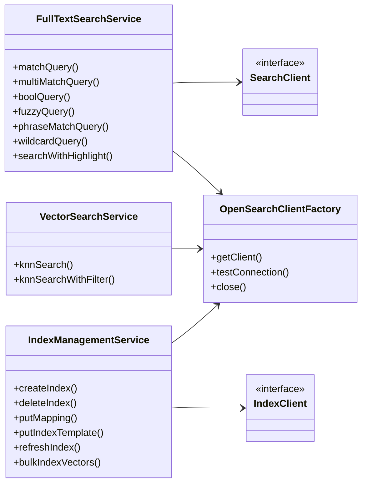
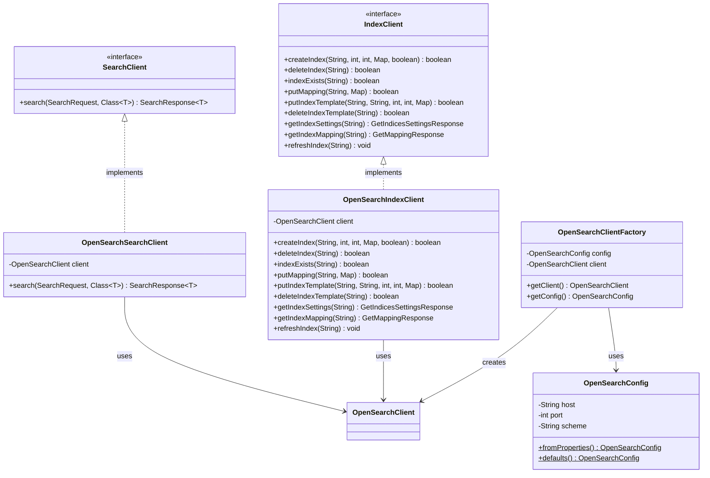

# クラス図

## 全体クラス図

```mermaid
classDiagram
    direction TB

    %% エントリーポイント
    class OpenSearchSandboxApplication {
        +main(String[] args)$
    }

    %% デモランナー
    class DemoRunner {
        -OpenSearchClientFactory clientFactory
        -FullTextSearchDemo fullTextSearchDemo
        -VectorSearchDemo vectorSearchDemo
        -IndexManagementService indexService
        +DemoRunner()
        +main(String[] args)$
        +run()
        -testConnection() boolean
        -runDemos()
        -cleanup()
    }

    class FullTextSearchDemo {
        -OpenSearchClient client
        -IndexManagementService indexService
        -FullTextSearchService searchService
        +FullTextSearchDemo(OpenSearchClient, IndexManagementService, FullTextSearchService)
        +run()
        +getIndexName() String
    }

    class VectorSearchDemo {
        -IndexManagementService indexService
        -VectorSearchService searchService
        -Random random
        +VectorSearchDemo(IndexManagementService, VectorSearchService)
        +run()
        +getIndexName() String
    }

    class SearchResultPrinter {
        +print(SearchResponse)$
        +printWithHighlight(SearchResponse)$
        +printKnnResults(SearchResponse)$
    }

    %% 設定
    class OpenSearchConfig {
        -String host
        -int port
        -String scheme
        -int connectionTimeout
        -int socketTimeout
        -int numberOfShards
        -int numberOfReplicas
        -int knnDimension
        -String knnSpaceType
        +fromProperties()$ OpenSearchConfig
        +defaults()$ OpenSearchConfig
        +getHost() String
        +getPort() int
        +getScheme() String
        +getConnectionUrl() String
    }

    class OpenSearchConfig_Builder {
        -String host
        -int port
        -String scheme
        +host(String) Builder
        +port(int) Builder
        +scheme(String) Builder
        +build() OpenSearchConfig
    }

    %% クライアント
    class OpenSearchClientFactory {
        -OpenSearchConfig config
        -OpenSearchClient client
        -OpenSearchTransport transport
        +OpenSearchClientFactory(OpenSearchConfig)
        +create()$ OpenSearchClientFactory
        +createWithDefaults()$ OpenSearchClientFactory
        +getClient() OpenSearchClient
        +getConfig() OpenSearchConfig
        +testConnection() boolean
        +close()
    }

    class SearchClient {
        <<interface>>
        +search(SearchRequest, Class~T~) SearchResponse~T~
    }

    class OpenSearchSearchClient {
        -OpenSearchClient client
        +OpenSearchSearchClient(OpenSearchClient)
        +search(SearchRequest, Class~T~) SearchResponse~T~
    }

    %% サービス
    class FullTextSearchService {
        -SearchClient client
        +FullTextSearchService(OpenSearchClientFactory)
        +matchQuery(String, String, String, Class~T~) SearchResponse~T~
        +multiMatchQuery(String, List~String~, String, Class~T~) SearchResponse~T~
        +boolQuery(String, List~Query~, List~Query~, List~Query~, Class~T~) SearchResponse~T~
        +fuzzyQuery(String, String, String, String, Class~T~) SearchResponse~T~
        +phraseMatchQuery(String, String, String, Class~T~) SearchResponse~T~
        +wildcardQuery(String, String, String, Class~T~) SearchResponse~T~
        +searchWithHighlight(String, String, String, Class~T~) SearchResponse~T~
        +extractDocuments(SearchResponse~T~) List~T~
        +extractHighlights(Hit~T~) Map
    }

    class VectorSearchService {
        -OpenSearchClient client
        +VectorSearchService(OpenSearchClientFactory)
        +knnSearch(String, String, float[], int, Class~T~) SearchResponse~T~
        +knnSearchWithFilter(String, String, float[], int, Query, Class~T~) SearchResponse~T~
    }

    class IndexManagementService {
        -IndexClient client
        -OpenSearchClient openSearchClient
        -OpenSearchConfig config
        +IndexManagementService(OpenSearchClientFactory)
        +createIndex(String) boolean
        +createIndex(String, Map) boolean
        +createIndex(String, Map, boolean) boolean
        +deleteIndex(String) boolean
        +indexExists(String) boolean
        +putMapping(String, Map) boolean
        +putIndexTemplate(String, String, Map) boolean
        +deleteIndexTemplate(String) boolean
        +getIndexSettings(String) GetIndicesSettingsResponse
        +getIndexMapping(String) GetMappingResponse
        +refreshIndex(String) boolean
        +bulkIndexVectors(String, String, List~VectorDocument~) void
    }

    class IndexClient {
        <<interface>>
        +createIndex(String, int, int, Map, boolean) boolean
        +deleteIndex(String) boolean
        +indexExists(String) boolean
        +putMapping(String, Map) boolean
        +putIndexTemplate(String, String, int, int, Map) boolean
        +deleteIndexTemplate(String) boolean
        +getIndexSettings(String) GetIndicesSettingsResponse
        +getIndexMapping(String) GetMappingResponse
        +refreshIndex(String) void
    }

    class OpenSearchIndexClient {
        -OpenSearchClient client
        +createIndex(String, int, int, Map, boolean) boolean
        +deleteIndex(String) boolean
        +indexExists(String) boolean
        +putMapping(String, Map) boolean
        +putIndexTemplate(String, String, int, int, Map) boolean
        +deleteIndexTemplate(String) boolean
        +getIndexSettings(String) GetIndicesSettingsResponse
        +getIndexMapping(String) GetMappingResponse
        +refreshIndex(String) void
    }

    %% 内部レコード
    class VectorDocument {
        <<record>>
        +String id
        +float[] vector
        +Map metadata
    }

    %% 関係
    OpenSearchSandboxApplication --> DemoRunner : uses
    DemoRunner --> OpenSearchClientFactory : creates
    DemoRunner --> FullTextSearchDemo : uses
    DemoRunner --> VectorSearchDemo : uses
    DemoRunner --> IndexManagementService : uses
    FullTextSearchDemo --> FullTextSearchService : uses
    FullTextSearchDemo --> IndexManagementService : uses
    VectorSearchDemo --> VectorSearchService : uses
    VectorSearchDemo --> IndexManagementService : uses

    OpenSearchConfig +-- OpenSearchConfig_Builder : inner class

    OpenSearchClientFactory --> OpenSearchConfig : uses
    OpenSearchClientFactory --> OpenSearchClient : creates

    SearchClient <|.. OpenSearchSearchClient : implements
    OpenSearchSearchClient --> OpenSearchClient : wraps

    FullTextSearchService --> SearchClient : uses
    FullTextSearchService --> OpenSearchClientFactory : receives

    VectorSearchService --> OpenSearchClient : uses
    VectorSearchService --> OpenSearchClientFactory : receives

    IndexManagementService --> IndexClient : uses
    IndexManagementService +-- VectorDocument : inner record
    IndexManagementService --> OpenSearchConfig : uses
    IndexManagementService --> OpenSearchClientFactory : receives
    IndexClient <|.. OpenSearchIndexClient : implements
    OpenSearchIndexClient --> OpenSearchClient : wraps
```

## サービス層クラス図



## クライアント層クラス図



## 設計パターン

| パターン | 適用箇所 | 説明 |
|---------|---------|------|
| Builder | OpenSearchConfig.Builder | イミュータブルな設定オブジェクトの構築 |
| Factory | OpenSearchClientFactory | OpenSearchClientインスタンスの生成管理 |
| Singleton | OpenSearchClientFactory.getClient() | クライアントインスタンスの遅延初期化と再利用 |
| Strategy | SearchClient, IndexClient interfaces | 検索・インデックス実装の抽象化（テスト容易性向上） |
| Record | VectorDocument, ScoredDocument | イミュータブルなデータ転送オブジェクト |